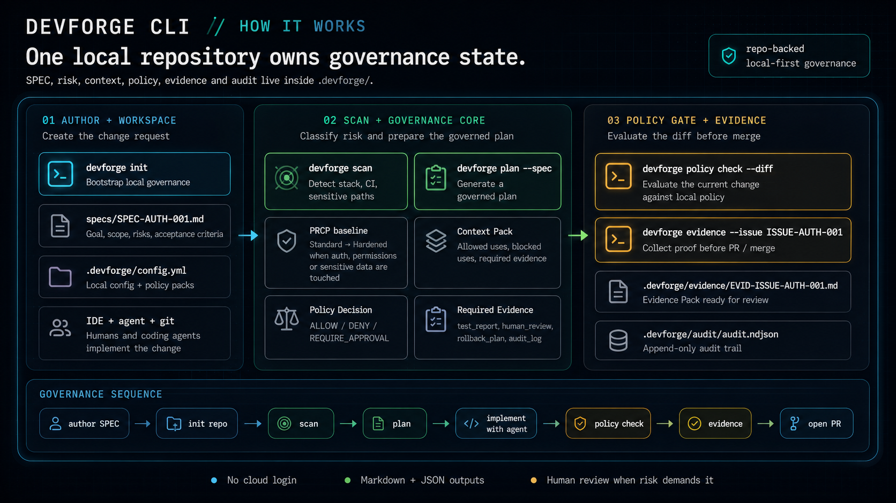

# DevForge CLI

> **Local-first governance CLI for AI-assisted SDLC.**  
> Classifique risco, controle contexto, aplique políticas e gere evidências auditáveis antes do merge.

<p align="center">
  
</p>

---

## O que é o DevForge CLI?

**DevForge CLI** é uma ferramenta open-source para ajudar desenvolvedores e times a governar mudanças feitas com IA antes do merge.

Ele não é uma IDE.  
Ele não é um agente de código.  
Ele não substitui Cursor, Claude Code, Codex, Copilot, OpenCode ou qualquer outro agente.

A proposta é simples:

> **Agentes executam. DevForge governa.**

Antes de uma mudança entrar no repositório principal, o DevForge CLI ajuda a responder:

- Essa mudança toca áreas sensíveis?
- Qual é o risco proporcional da alteração?
- Qual contexto a IA poderia usar?
- Quais políticas se aplicam?
- Quais evidências precisam existir antes do merge?
- Precisa de revisão humana?
- Existe trilha auditável do que aconteceu?

---

## Por que isso existe?

Ferramentas de IA conseguem gerar código muito rápido.

Mas velocidade sem governança cria novos problemas:

- código gerado sem contexto suficiente;
- mudanças em autenticação, permissões ou dados sensíveis sem revisão;
- pull requests difíceis de auditar;
- decisões importantes perdidas em chats;
- falta de evidência sobre testes, rollback e aprovação humana;
- dificuldade para saber se uma mudança feita com IA pode avançar com segurança.

O **DevForge CLI** cria uma camada local e simples de governança para esse fluxo.

---

## Fluxo principal

```text
init → scan → plan → policy check → evidence
Ou, em linguagem prática:

author SPEC → init repo → scan → plan → implement with agent → policy check → evidence → open PR
Como funciona
1. devforge init

Inicializa a governança local dentro do repositório.

devforge init

Cria a estrutura:

.devforge/
├── config.yml
├── prcp/
├── context/
├── plans/
├── policy/
├── evidence/
└── audit/
2. devforge scan

Escaneia o repositório para detectar stack, CI, áreas sensíveis e sinais de risco.

devforge scan

Exemplo de saída:

[DevForge] Escaneando repositório...

✔ Stack detectada: Next.js · React · FastAPI · PostgreSQL
✔ CI detectado: GitHub Actions
✔ Áreas sensíveis encontradas: auth, permissões, dados pessoais

PRCP baseline do projeto: Standard
Elevação por tarefa: Hardened

Arquivos gerados:
.devforge/prcp/project-profile.json
.devforge/prcp/scan-report.md
3. devforge plan

Gera um plano governado a partir de uma SPEC.

devforge plan --spec specs/SPEC-AUTH-001.md

Esse comando gera:

.devforge/plans/PLAN-SPEC-AUTH-001.md
.devforge/context/context-pack.md
.devforge/policy/POLICY-DECISION-001.json

O plan não gera código.

Ele gera:

tarefas;
contexto permitido;
contexto bloqueado;
política inicial;
evidências obrigatórias;
pontos de revisão humana.
4. Implementação com humano ou agente

Depois do plano, você implementa a mudança usando sua ferramenta preferida:

Cursor;
Claude Code;
Codex;
Copilot;
OpenCode;
agente próprio;
ou implementação manual.

O DevForge CLI não compete com essas ferramentas.

Ele entra antes do merge.

5. devforge policy check

Avalia o diff atual contra as políticas locais.

devforge policy check --diff

Exemplo:

[DevForge] Avaliando mudança atual...

✔ Diff analisado: 14 arquivos
✔ Context Pack carregado
✔ Policy rules carregadas

Decision: REQUIRE_APPROVAL
Pode avançar agora? Não ainda

Reasons:
- touches_auth
- sensitive_data_possible
- human_review_required

Required evidence:
- test_report
- human_review
- rollback_plan

Exit code: 1

Decisões possíveis:

ALLOW
DENY
REQUIRE_APPROVAL
6. devforge evidence

Gera o pacote de evidência antes do PR ou merge.

devforge evidence --issue ISSUE-AUTH-001

Exemplo de saída:

[DevForge] Montando Evidence Pack...

✔ Issue carregada: ISSUE-AUTH-001
✔ Diff anexado
✔ Test report anexado
✔ Rollback plan anexado
✔ Audit trail atualizado

Evidence Pack:
id: EVID-ISSUE-AUTH-001
status: ready_for_review
tests_passed: true
human_review_required: true
final_decision: pending_human_review

Arquivos gerados:
.devforge/evidence/EVID-ISSUE-AUTH-001.md
.devforge/audit/audit.ndjson
Instalação

O projeto ainda está em fase inicial. Os comandos abaixo representam a instalação planejada para o pacote público.

Com pipx:

pipx install devforge-ai-cli

Com uv:

uv tool install devforge-ai-cli

Depois:

devforge --version
Quickstart
# 1. Instale a CLI
pipx install devforge-ai-cli

# 2. Entre no seu projeto
cd meu-projeto

# 3. Inicialize a governança local
devforge init

# 4. Escaneie stack, risco e áreas sensíveis
devforge scan

# 5. Crie uma SPEC de mudança
mkdir -p specs
touch specs/SPEC-AUTH-001.md

# 6. Gere um plano governado
devforge plan --spec specs/SPEC-AUTH-001.md

# 7. Implemente com seu editor, agente ou IDE

# 8. Verifique política antes do merge
devforge policy check --diff

# 9. Gere o pacote de evidência
devforge evidence --issue ISSUE-AUTH-001
Exemplo de história

Imagine um projeto chamado Plantão Fácil, um sistema para troca de plantões.

Você quer implementar:

Login com e-mail/senha e controle básico de papéis: admin, supervisor e operador.

Essa mudança toca:

autenticação;
permissões;
dados pessoais;
rotas protegidas.

Então o DevForge CLI pode elevar o risco da tarefa para Hardened e exigir:

relatório de testes;
plano de rollback;
revisão humana;
trilha de auditoria.

Fluxo:

devforge init
devforge scan
devforge plan --spec specs/SPEC-AUTH-001.md

# implementação com humano ou agente

devforge policy check --diff
devforge evidence --issue ISSUE-AUTH-001

No fim, o PR pode carregar um resumo como:

## DevForge Evidence

- Evidence Pack: `.devforge/evidence/EVID-ISSUE-AUTH-001.md`
- Policy Decision: `REQUIRE_APPROVAL`
- PRCP: `Hardened`
- Tests: passed
- Human Review: required
- Rollback Plan: present
Estrutura gerada no projeto
.devforge/
├── config.yml
├── prcp/
│   ├── project-profile.json
│   └── scan-report.md
├── context/
│   └── context-pack.md
├── plans/
│   └── PLAN-SPEC-AUTH-001.md
├── policy/
│   └── POLICY-DECISION-001.json
├── evidence/
│   ├── EVID-ISSUE-AUTH-001.md
│   └── EVID-ISSUE-AUTH-001.json
└── audit/
    └── audit.ndjson
Conceitos principais
PRCP

PRCP significa Project Risk & Complexity Profile.

É uma forma de classificar o risco proporcional de um projeto ou mudança.

Exemplos de sinais que podem elevar o risco:

autenticação;
permissões;
dados pessoais;
integrações externas;
impacto em produção;
mudanças em banco de dados;
sistemas legados;
requisitos regulatórios.
Context Pack

O Context Pack define o que pode ou não pode ser usado como contexto.

Exemplo:

allowed_uses:
  - arquitetura
  - testes
  - revisão
  - contratos públicos

blocked_uses:
  - secrets reais
  - senhas
  - tokens de produção
  - dados pessoais brutos

required_evidence:
  - test_report
  - human_review
  - rollback_plan
  - audit_log
Policy Gate

O Policy Gate avalia se uma mudança pode avançar.

Possíveis decisões:

ALLOW
DENY
REQUIRE_APPROVAL

Exemplo:

Decision: REQUIRE_APPROVAL

Reasons:
- touches_auth
- sensitive_data_possible
- human_review_required
Evidence Pack

O Evidence Pack é um pacote auditável que mostra o que foi feito, testado, revisado e aprovado.

Ele pode incluir:

diff;
test report;
typecheck;
rollback plan;
human review;
policy decision;
audit log.
Audit Trail

O DevForge CLI mantém uma trilha local em NDJSON:

.devforge/audit/audit.ndjson

Exemplo de evento:

{
  "event": "policy.check",
  "spec_id": "SPEC-AUTH-001",
  "decision": "REQUIRE_APPROVAL",
  "reasons": ["touches_auth", "human_review_required"],
  "timestamp": "2026-05-20T10:30:00Z"
}
O que o DevForge CLI não é

O DevForge CLI não é:

uma IDE;
um agente de código;
um orquestrador multiagente;
um substituto para GitHub, GitLab ou Jira;
um SaaS obrigatório;
uma ferramenta que chama LLM por padrão;
uma ferramenta que envia seu código para a nuvem.

No MVP, o foco é:

local-first
determinístico
sem cloud login
sem telemetria silenciosa
Markdown + JSON
auditável
Roadmap inicial
MVP Community
 devforge init
 devforge scan
 devforge plan
 devforge policy check
 devforge evidence
 saída Markdown + JSON
 audit trail local em NDJSON
 exemplo Plantão Fácil
 GitHub Pages
 CI com testes
Depois do MVP
 GitHub Actions integration
 policy packs customizados
 suporte a múltiplos perfis PRCP
 templates de Evidence Pack
 validação de schemas
 integração MCP local
 adapters para agentes e IDEs
 dashboard web opcional
 modo team/enterprise
Exemplo de comandos
devforge init
devforge scan
devforge plan --spec specs/SPEC-AUTH-001.md
devforge policy check --diff
devforge evidence --issue ISSUE-AUTH-001
Para quem é

DevForge CLI é para:

desenvolvedores usando IA no dia a dia;
tech leads revisando código gerado por agentes;
times que querem governança antes do merge;
projetos open-source que querem rastreabilidade;
equipes que precisam de evidência mínima sobre mudanças críticas;
devs que querem usar IA sem perder controle.
Princípios
Local-first
O estado de governança vive no seu repositório.
Markdown + JSON
Humanos leem Markdown. Ferramentas processam JSON.
Sem cloud login obrigatório
O MVP deve funcionar sem conta, sem SaaS e sem rede.
Agente não decide sozinho
IA pode sugerir e executar, mas mudanças de risco exigem política, evidência e revisão.
Evidência antes do merge
Pull requests devem carregar prova mínima do que foi feito.
Governança proporcional ao risco
Nem toda mudança precisa do mesmo rigor.
Contribuindo

Contribuições são bem-vindas.

Você pode ajudar com:

implementação dos comandos;
exemplos reais;
policy packs;
documentação;
testes;
templates de evidência;
melhorias de UX no terminal;
integração com GitHub Actions.

Fluxo sugerido:

git clone https://github.com/mffdeo/devforge-ai-cli.git
cd devforge-ai-cli
python -m venv .venv
source .venv/bin/activate
pip install -e ".[dev]"
pytest
Desenvolvimento local
# Instalar dependências de desenvolvimento
pip install -e ".[dev]"

# Rodar testes
pytest

# Rodar lint
ruff check .

# Testar CLI localmente
devforge --help
Status do projeto

Este projeto está em fase inicial.

A visão é construir uma CLI comunitária, simples e útil para governar mudanças feitas com IA antes do merge.

O objetivo do primeiro release não é fazer tudo.

O objetivo é provar um fluxo:

scan → plan → policy check → evidence

Se esse fluxo for útil, o projeto evolui.

Licença

MIT License.

Frase curta

Before merging AI-assisted code, run DevForge.
